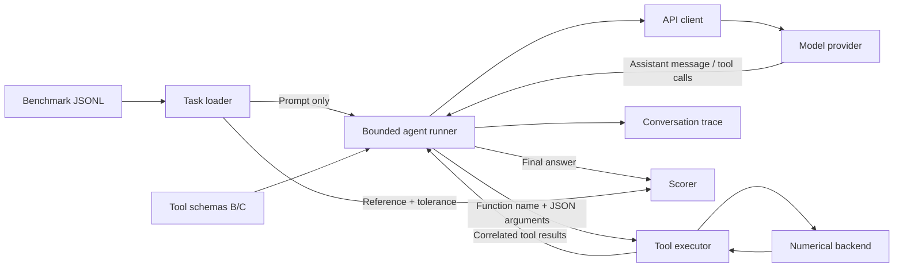

# AstroToolBench

A benchmark for language models that use orbital mechanics tools.

AstroToolBench compares a minimal tool interface (B), an interface with explicit
units and input conventions (C), and a baseline without tools (A). NumPy routines
handle the calculations; an agent connects them to a model through a chat API.
Post-training and inference experiments are planned after the interface baseline.

## Status

The numerical tools, A/B/C agent runner, single-task CLI and tokenizer inspection
are implemented. The scientific backend now has explicit input validation and
documented contracts for propagation, delta-v, Hohmann transfers, eclipses and
closest approach; see [milestone 1 scientific tools](docs/scientific-tools.md).
A five-task condition C
smoke test on Nemotron 3.5 Lightning passed **4/5 numerical checks** on 3 October
2026, including two dependent tool calls. Three responses were standalone final
JSON objects; Hohmann lacked a final answer and the eclipse response had trailing
text. These outcomes are retained in the [validation report](docs/release-validation.md)
and [recorded traces](docs/examples/nvidia-lightning-smoke.json).

This is an integration baseline on development tasks. Comparative A/B/C results
and post-training remain planned.

## Architecture

Two Python packages separate scientific computation from model interaction:

| Component | Responsibility |
| --- | --- |
| `astrodyn_tools` | Numerical flight-dynamics routines, constants and analytic validation tests. |
| `atb.tools` | OpenAI-compatible function schemas for the B and C interfaces. |
| `atb.executor` | Dispatch tool requests to the numerical backend; convert inputs and serialize results or errors. |
| `atb.tasks` | Load and validate benchmark tasks from JSONL. |
| `atb.scoring` | Compare a final response against the task reference and numerical tolerances. |
| `atb.client` | Configure the provider, build requests and send Chat Completions. |
| `atb.prompts` | Shared instructions and prompt construction for A/B/C runs. |
| `atb.agent` | Run the model/tool loop, handle failures and persist conversation traces. |
| `atb.agent_cli` | Run and score one task; display the conversation or a JSON summary. |
| `atb.inspection` | Inspect raw completions and persist request/response traces. |
| `atb.template_inspection` | Render recorded conversations locally and compare tool token costs. |

The agent connects the model to numerical tools and keeps scoring separate:



Condition A uses the same instructions with no tool schemas. The inspection
command stops at a single model response; the agent command executes requested
tools and continues to a final answer or an explicit terminal status. See
[architecture and data flow](docs/architecture.md) for the component boundaries.

## Installation

Python 3.10 or later:

```bash
python3 -m venv .venv
source .venv/bin/activate
python -m pip install ".[dev,llm]"
python -m pytest -q
```

For source development, use `pip install -e ".[dev,llm]"`. The `llm` extra adds the
API client and dotenv support; `.[dev]` is sufficient for numerical tools, task
loading and scoring. Tests requiring the LLM extra are skipped when it is absent.

## Inspect a model completion

From the repository root:

```bash
cp .env.example .env
# Set NVIDIA_API_KEY locally in .env.
atb-inspect --dry-run
atb-inspect --task period-001 --require-tool-call
```

The command prints the complete request body, raw model response and tool-call
observations. It saves traces under `results/completions/`. Credentials and
headers are excluded; `.env` and local results are ignored by Git.

The default configuration targets NVIDIA's API Catalog with Nemotron 3.5 Lightning.
An earlier Nemotron 3 Super request returned `orbital_period` with `{"altitude_km":400}` and
`finish_reason: "tool_calls"`. The [recorded response](docs/examples/nvidia-nemotron-orbital-period.json)
provides evidence for this integration check. Numerical answer accuracy is
measured separately once tools are executed and a final answer is available.

See [completion inspection](docs/completion-inspection.md) for provider
configuration, request controls and response fields. CI runs offline tests and
an offline request preview on Python 3.10 and 3.12. Tokenizer files are downloaded
once at a pinned revision; CI makes no model API calls.

## Run an agent task

With the same provider configuration:

```bash
atb-run --task multi-001 --api C --reasoning-budget 256 --timeout 120
atb-run --task multi-001 --api C --reasoning-budget 256 --timeout 120 --verbose
atb-run --task period-001 --api A --max-steps 8
```

`multi-001` obtains a Hohmann transfer duration and uses it to propagate an
explicit initial ECI state. The command reports the final answer, numerical
score, tool calls, tokens and latency. `--verbose` adds the initial instructions,
call IDs and per-turn metrics; `--json` prints a summary for scripts. Every run
writes a trace to
`results/traces/<run_id>/<task_id>.json`, including failures and exhausted budgets.

See [agent execution](docs/agent-execution.md) for the Python API, message protocol
and trace contract. A [recorded Nemotron run](docs/examples/nvidia-nemotron-agent.json)
completed two dependent tool calls in successive responses and passed the
numerical check. Offline tests also cover multiple calls in one response.

`--reasoning-budget` is an explicit NVIDIA inference setting, recorded in the
trace and sent at every turn. Omitting it leaves the provider's default in effect.

Run the same five-task integration check with:

```bash
python scripts/smoke_test.py --api C --reasoning-budget 256 --timeout 120
```

The script retains failed outcomes, prints each result and exits with code 1 if
any task fails. See the validation report for the exact configuration and limits.

## Inspect a chat tokenizer

Benchmark prompts and recorded agent conversations can be rendered with an
open model's chat template without loading model weights or PyTorch. The command
also compares B/C token costs and isolates description fields. See
[chat tokenizer inspection](docs/template-inspection.md) for the optional
dependency, download and cache controls.

```bash
python -m pip install ".[tokenizer]"
python scripts/inspect_template.py --task period-001
python scripts/inspect_template.py --trace docs/examples/nvidia-nemotron-agent.json \
  --compare-tools --local-files-only
```

## Experimental design

| Condition | Interface and model configuration |
| --- | --- |
| A | Model receives no tool schemas. |
| B | Minimal tool descriptions and parameter conventions. |
| C | Explicit units, input conventions and actionable errors. |
| D | Fine-tuned open model using interface C. |

B and C use the same numerical backend. Parameter conventions, unit conversions
and error messages are part of the interface treatment. Comparisons must hold the
model, tasks and generation settings constant and report these differences.

The benchmark includes numerical tasks and requests requiring a refusal. Target
metrics include numerical success, argument errors, unsupported answers, tool
calls, tokens and latency. Comparative results have not been produced yet.

## Scientific conventions

Distances: km; velocities: km/s; time: s; angles: rad. State vectors use an
Earth-centered inertial frame. The backend uses two-body dynamics and a
cylindrical Earth-shadow model. The C interface accepts orbital altitudes for
period and Hohmann calculations; position vectors are measured from Earth's
center.

The scientific backend can be used offline with `pip install -e '.[dev]'`.
Its [tool contracts and examples](docs/scientific-tools.md) specify inputs,
outputs, errors, singular-orbit conventions, custom central bodies and the
sampling limits of eclipse and proximity searches. Run its checks with
`python -m pytest tests/tools tests/test_core.py -q`.

Generated references check consistency with the numerical backend. Analytic and
textbook tests provide separate validation of the physical calculations. Current
task families and splits will require an explicit contamination review before
training and reporting held-out model results.

## Roadmap

- Comparative evaluation across models and interface conditions.
- Family-separated training and evaluation data.
- PyTorch/LoRA post-training and vLLM inference experiments.
